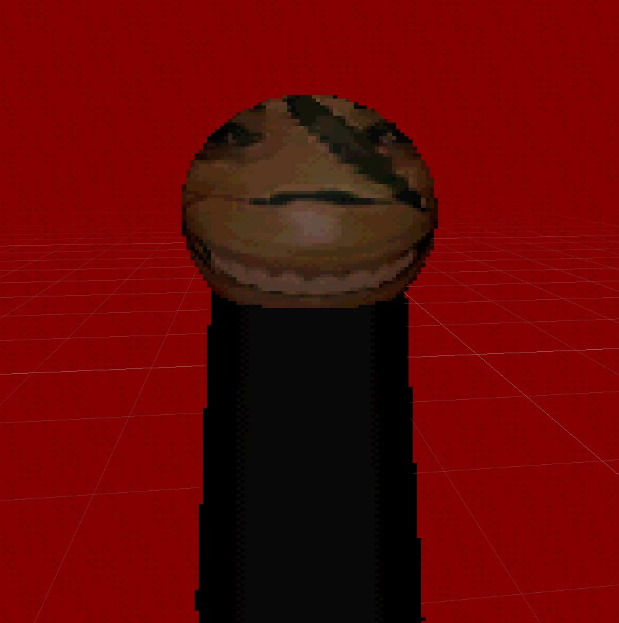

# Signalis: Emptiness :3

> ⚠️ **Важно / Important**: Это неофициальный фан-проект. Не связан с разработчиками оригинальной игры.  
> *This is an unofficial fan project. Not affiliated with the original game developers.*

---

## 📖 Описание / Description

**🇷🇺 Русский**  
Это моя первая игра на Godot, возможны баги!
Помогите LSTR пройти этот ад. Действия игры происходят во время странствий Эльстер по Красной пустыне — в промежутке между событиями основной игры.

**🇬🇧 English**  
This is my first game on Godot, bugs are possible!
Help LSTR survive this hell. The game takes place during Elster's wanderings through the Red Desert — between the main story.

---

## 🎮 Управление / Controls

| Клавиша / Key | Действие / Action       |
|---------------|-------------------------|
| `A` / `D`     | Влево / Вправо          |
| `W` / `Space` | Прыжок / Jump           |
| `S`           | Присесть / Crouch       |
| `Esc`         | Пауза / Pause           |

---

## ⚙️ Как запустить / How to Run

### Инструкция / Steps
1. Перейдите на вкладку **[Releases]**/ Go to the **[Releases]
2. Скачайте архив / Download the archive
3. Распакуйте архив в любую папку / Extract the archive to any folder
4. Запустите файл **`Signalis-Emptiness.exe`** / Run **`Signalis-Emptiness.exe`**

---

## ⚖️ Правовая информация / Legal Notice

### 🇷🇺 Русский
Это **некоммерческий фан-проект**, созданный исключительно в образовательных целях и как дань уважения оригинальной игре.

Все права на игру **«Signalis»**, персонажей (включая Эльстер / Elster), локации, музыка и визуальный стиль принадлежат:
> **© Rose Engine** (Германия)  
> **© Humble Games** (издатель)

Проект:
- ❌ Не является официальным дополнением
- ❌ Не монетизируется (бесплатный)
- ✅ Создан исключительно для личного обучения и фанатского творчества

Поддержите официальную игру:  
[Steam](https://store.steampowered.com/app/1262350/SIGNALIS/) | [Официальный сайт](https://rose-engine.org/)

### 🇬🇧 English
This is a **non-commercial fan project** created solely for educational purposes and as a tribute to the original game.

All rights to **«Signalis»**, characters (including Elster), locations, story and visual style belong to:
> **© Rose Engine** (Germany)  
> **© Humble Games** (publisher)

This project:
- ❌ Is not an official expansion or DLC
- ❌ Is not monetized (free)
- ✅ Is made exclusively for personal learning and fan creativity

Support the official game:  
[Steam](https://store.steampowered.com/app/1262350/SIGNALIS/) | [Official website](https://rose-engine.org/)

---

> ℹ️ *Если вы представитель Rose Engine или Humble Games и считаете, что проект нарушает ваши права — пожалуйста, свяжитесь со мной через мой профиль перед отправкой DMCA-запроса. Проект будет немедленно удалён.*  
> *If you represent Rose Engine or Humble Games and believe this project infringes your rights — please contact me via my GitHub profile before filing a DMCA takedown. The project will be removed immediately.*

---

## 📜 Лицензия / License

Код и оригинальные ассеты проекта распространяются под лицензией **MIT**:

⚠️ Эта лицензия **не распространяется** на интеллектуальную собственность Rose Engine / Humble Games.

MIT License
Copyright (c) 2026 Koshkerrr
